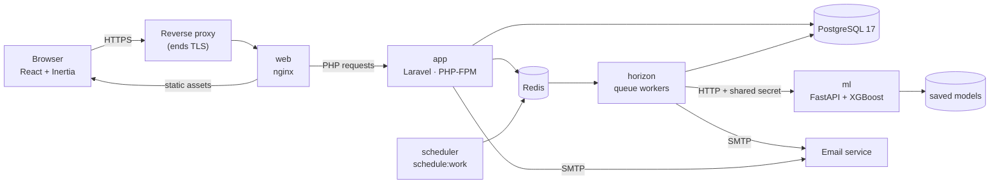
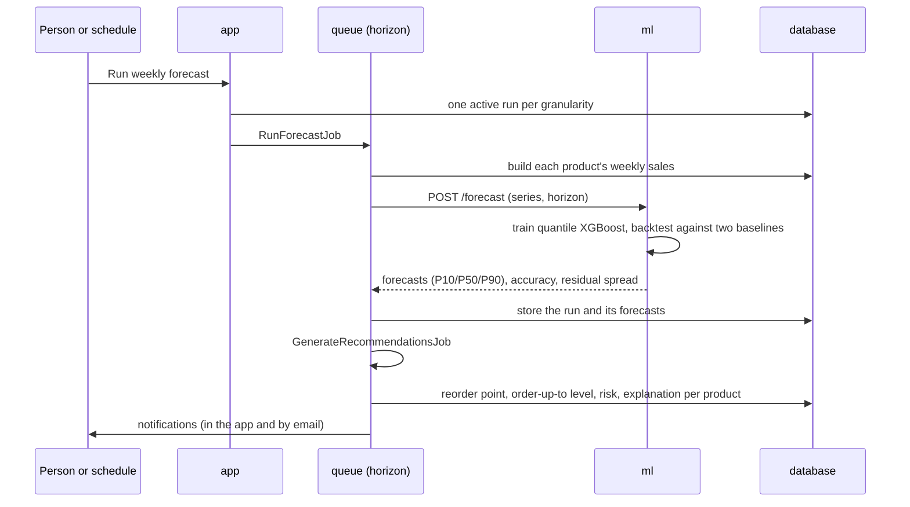

# Architecture

StockSense AI is a decision-support web application for small and medium-sized shops. It forecasts sales, works out what to reorder and when, and tells the right people. It is **advisory only**: it never places an order, and it handles no suppliers, payments, point-of-sale systems or customer data.

## The pieces



| Piece | What it does | Technology |
|---|---|---|
| **web** | Serves the built JavaScript and CSS itself, hands everything else to the app | nginx |
| **app** | All pages, business rules, permissions, the database | Laravel 13, PHP 8.4, Inertia, React 19, TypeScript, Tailwind 4 |
| **horizon** | Runs the slow work on queues: imports, forecast runs, recommendations, emails | Laravel Horizon on Redis |
| **scheduler** | Starts the daily and weekly jobs | `schedule:work` |
| **ml** | Trains the forecasting model and makes forecasts. Reachable only by the app | Python 3.12, FastAPI, XGBoost, pandas |
| **db** | Everything the application knows | PostgreSQL 17 |
| **redis** | Queues, cache | Redis 7 |

Laravel owns **all** data and business rules. The ML service holds only saved model files: it receives time series as JSON and answers with forecasts and accuracy figures, like a pure function, which makes it easy to test on its own and against the contract.

## How a forecast becomes advice



- **Forecasting** is described in [ml-methodology.md](ml-methodology.md): one pooled model across all products, three quantiles, a backtest against "the same week last year" and "a recent average", and a plain average for products with under a year of history.
- **Replenishment** is described in [replenishment-methodology.md](replenishment-methodology.md): safety stock from the service level and the forecast's own error, a reorder point, an order-up-to level, five risk levels, each with a sentence of reasoning.
- **Decisions** are recorded with who, when and a note. Accepting counts the quantity as *on order* so the product is not recommended again; recording the goods arriving clears it.

## Design decisions worth knowing

- **One Laravel app, no separate API.** Inertia pairs Laravel's routing, sessions and validation with React pages, so there is one login, one set of permissions and no second authentication layer to get wrong.
- **Permissions are enforced on the server**, in routes and policies. The frontend hides what a person may not use, but never decides. A test lists every route and fails if one is reachable without a login unless it is on a short allowlist.
- **PostgreSQL, not SQLite**, in development and tests: weekly bucketing uses `date_trunc`, and partial unique indexes guarantee things such as *one open recommendation per product* and *one active forecast run per granularity* even when two workers race.
- **The contract between Laravel and the ML service is a JSON Schema** (`contracts/`) generated from the Python models. Both sides test against the same schemas and example payloads, so a change to one side that breaks the other fails a test.
- **Settings are changes on top of defaults.** The config files hold the defaults; the Owner's changes are stored (only changes) and put onto the config at start-up and before every queued job, so a long-running worker notices a change without a restart.
- **Emails never contain personal data**: a generic greeting, product and stock figures and a link back. Password links carry only a token. A test renders every email as actually sent and searches it for a user's name and address.
- **Everything is audited.** Sign-ins, catalog and user changes, sales and imports, forecast runs, decisions, settings and report exports are written to an append-only log that only the Owner can read.

## Built to grow into several branches

Branches are out of scope for the first version, but the data model does not stand in the way:

- A `locations` table with one default location; stock is kept per product *per location* (`inventory_levels`), not as a column on `products`.
- Sales, stock movements and recommendations carry a `location_id`.
- All stock reads and writes go through one `LocationContext` service, which today always returns the default location.
- Forecast series are keyed by a series key (today the product; later product and location), so the ML contract does not change.

What remains is listed in [future-multi-branch.md](future-multi-branch.md).

## Where things are

```
web/         Laravel + Inertia React app (app/, resources/js/, database/, tests/)
ml/          FastAPI forecasting service (app/, scripts/, tests/)
contracts/   JSON Schemas and example payloads shared by Laravel and the ML service
docker/      PHP, nginx and database images and configuration
e2e/         Playwright end-to-end tests
tests/load/  k6 load tests
docs/        this documentation
compose.yaml       development stack (bind mounts, Vite, Mailpit)
compose.prod.yaml  production stack (code in the images, nothing exposed but the web port)
```
